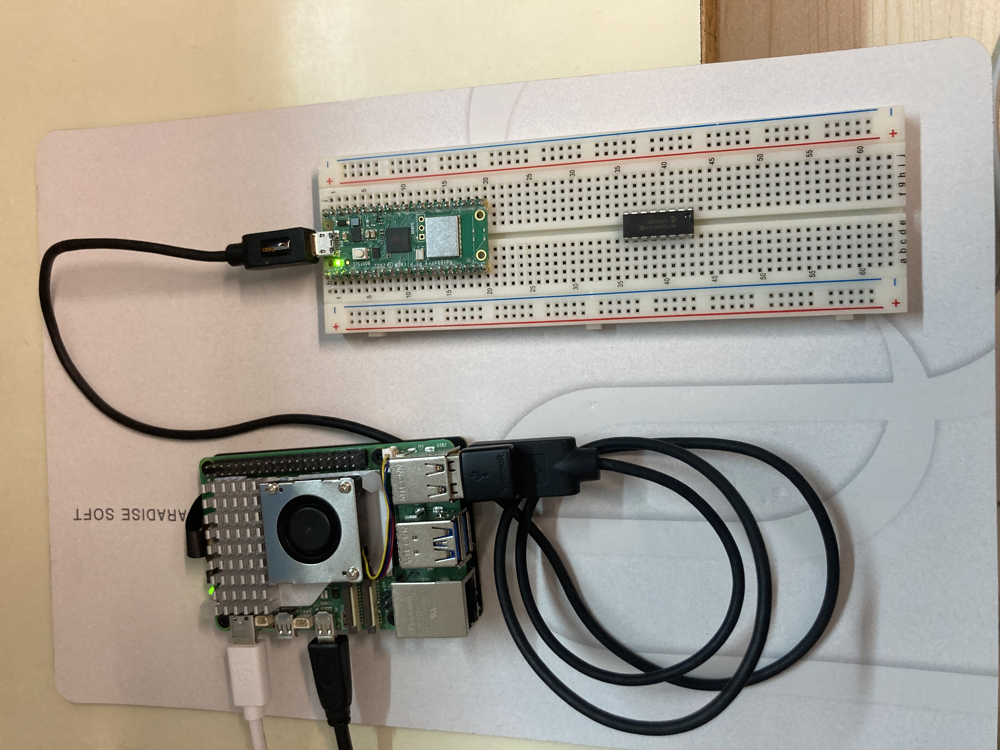
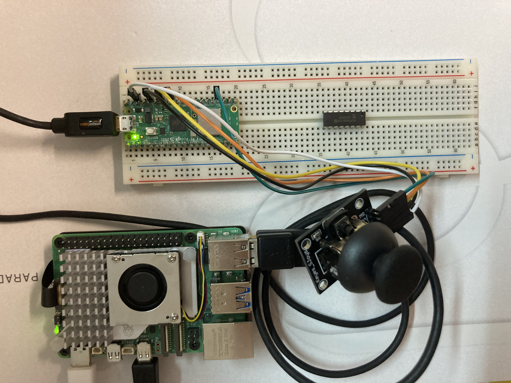

# Use VS code for Raspberry Pi Pico W
Install MicroPico from Extensions  
Press control+shift+P, type "MicroPico", and then select "MicroPico: Configure project"

# Use blinking.py make sure that pico w connect to raspberry pi 5
[code](./blinkingLED.py)  

# Search wifi
[code](./searchWifi.py)

# Connect wifi
[code](./connectWifi.py)

# Real time clock (RTC) get date and time
[code](./realTimeClock.py)

# Enable the WDT with a timeout of 5s (1s is the minimum)
[code](./wathdogTimer.py)

# Temperature sensor presents every 10 minutes

# Connect an Analog Joystick to the Pico W
GND to GND (physical pin 38)  
+5V to 3V3 Out (physical pin 37)  
VRx to GP28 / ADC2 (physical pin34)  
VRx to GP27 / ADC1 (physical pin32)  
SW to GP18 (physical pin24)   
[code](./gpio_analogJoystick.py)  
